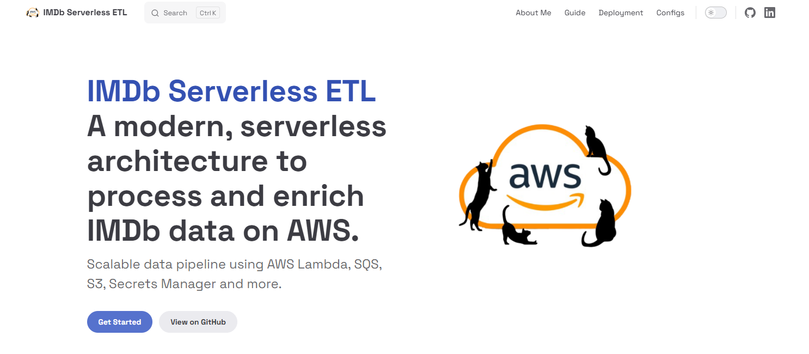

# IMDb Serverless ETL Documentation

[](https://paulodalsoto.github.io/imdb-serverless-etl-docs/)

[](https://github.com/PauloDalsoto/imdb-serverless-etl)

Official documentation for the **IMDb Serverless ETL** project — a comprehensive AWS-based pipeline for fetching, enriching, and storing IMDb Top 250 movie data. This documentation site provides detailed installation guides, architecture overview, deployment instructions, and technical specifications.



## About

This documentation repository serves as the main documentation hub for the [IMDb Serverless ETL project](https://github.com/PauloDalsoto/imdb-serverless-etl). The documentation covers:

- **Architecture Overview** - Understand the serverless pipeline design
- **Deployment Guide** - Step-by-step AWS deployment instructions
- **Component Details** - Deep dive into each AWS service used
- **Project Aspects** - Documentation, testing, logging, and error handling
- **Usage Instructions** - How to run and monitor the ETL pipeline

## Live Demo

The documentation is already live and accessible at:
**[https://paulodalsoto.github.io/imdb-serverless-etl-docs/](https://paulodalsoto.github.io/imdb-serverless-etl-docs/)**

## Prerequisites

Before running this documentation site locally, ensure you have:

- **Node.js** (version 16 or higher)
- **npm** or **yarn** package manager
- **Git** for cloning the repository

## Getting Started

### Clone the Repository

```bash
git clone https://github.com/PauloDalsoto/imdb-serverless-etl-docs.git
cd imdb-serverless-etl-docs
```

### Install Dependencies

```bash
npm install
```

### Run Development Server

Start the VitePress development server:

```bash
npm run docs:dev
```

The documentation site will be available at `http://localhost:5173`

## Project Structure

```
imdb-serverless-etl-docs/
├── docs/                         # Documentation source files
│   ├── index.md                  # Homepage
│   ├── about-me.md               # About the author
│   ├── guide/                    # Main documentation guides
│   │   ├── overview.md           # Project overview
│   │   ├── architecture.md       # Architecture documentation
│   │   ├── deployment.md         # Deployment guide
│   │   ├── sam-config.md         # SAM configuration
│   │   ├── architecture/         # Architecture details
│   │   ├── projectAspects/       # Project aspects (testing, logging, etc.)
│   │   └── projectComponents/    # AWS components documentation
│   ├── components/               # VitePress components
│   └── public/                   # Static assets
│       ├── logo.png
│       └── images/               # Documentation images
├── package.json                  # Project dependencies
└── README.md                     # This file
```